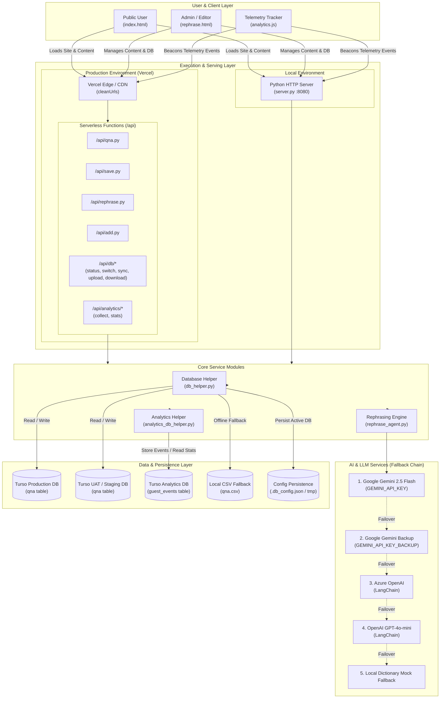
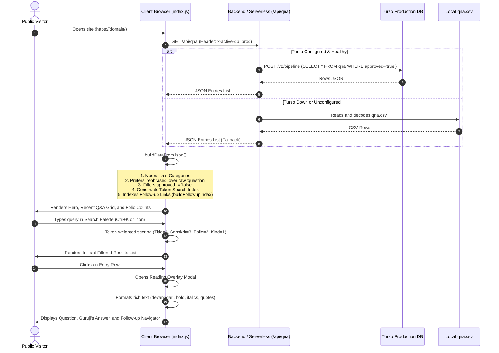
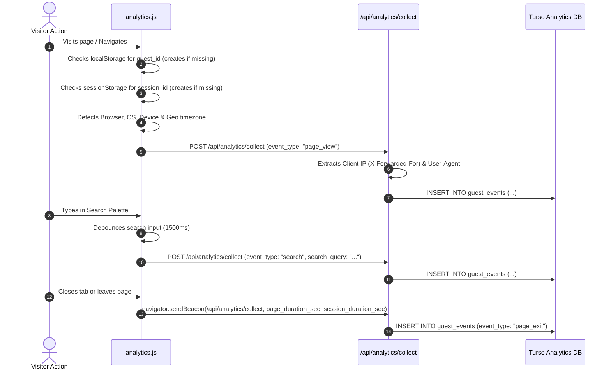
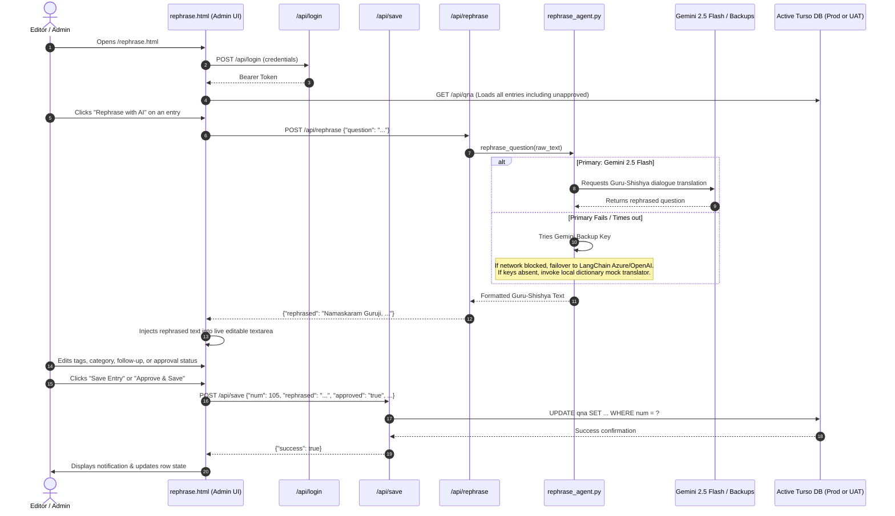
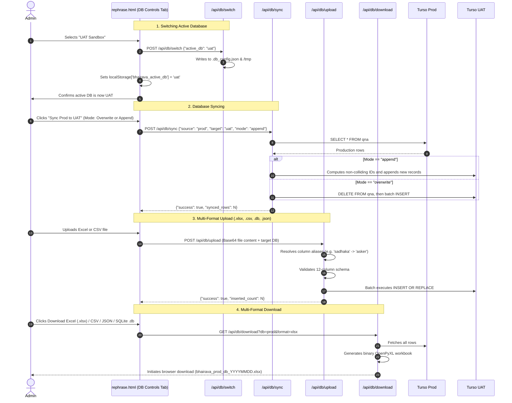

# Bhairava Anugraha — Complete System Architecture & Application Flow

> **Purpose of this document:**  
> This document provides an end-to-end technical explanation of the **Bhairava Anugraha** platform. It enables engineers, contributors, and administrators to understand the entire architecture, request lifecycles, database structures, AI workflows, and hosting configurations without needing to parse the source code line-by-line.

---

## 1. Executive Summary & System Overview

**Bhairava Anugraha** is a digital knowledge archive dedicated to spiritual Q&A dialogues answered by Guruji Lokesh regarding Mantra Sadhana, Puja & Rituals, Mandala Sadhana, Esoteric topics, and spiritual experiences.

The platform is designed with two core interfaces:
1. **Public Knowledge Archive (`index.html`, `index.js`, `index.css`)**:
   - High-performance, obsidian-and-gold ("Lacquer & Leaf") reader interface.
   - Client-side token-weighted fuzzy search palette.
   - Dynamic Folio (category) filters, reading overlay modal, and linked follow-up query chains.
   - Real-time client-side telemetry tracking.
2. **Editorial & Administration Studio (`rephrase.html`)**:
   - Protected multi-tab control room (`/rephrase.html` or `/rephrase`).
   - **Tab 1 — Review & Rephrase Q&A**: Human-in-the-loop editorial queue with multi-model AI rephrasing into traditional Guru-Shishya dialogue.
   - **Tab 2 — Database Controls**: Active database switching (`prod` vs `uat`), bidirectional syncing, multi-format backup/download, and spreadsheet/SQL upload with alias normalization.
   - **Tab 3 — Analytics Dashboard**: Real-time traffic stats, geographic telemetry, response times, top search keywords, and device distributions.
   - **Modal — Add New Q&A Entry**: Dedicated modal for creating and injecting new entries into the active database.

---

## 2. High-Level Architecture Diagram



---

## 3. Data Schema & Persistence Model

### 3.1 The 12-Column `qna` Schema
All Q&A entries in both Turso databases (`prod`, `uat`) and the local fallback file `qna.csv` conform to the unified 12-column structure:

| Column | Type | Description |
| :--- | :--- | :--- |
| `num` | `INTEGER PRIMARY KEY` | Canonical serial entry number (stable reference identifier). |
| `category` | `TEXT` | Canonical spiritual folio (e.g. *Mantra & Japa*, *Pūjā, Āratī & Rituals*, *Maṇḍala & Anuṣṭhāna*, *Experiences in Sādhanā*, *Advanced Topics*, *Women & Sādhanā*). |
| `asker` | `TEXT` | Name or alias of the spiritual seeker (defaults to "Anonymous" or "UAT Contributor"). |
| `date` | `TEXT` | Date formatted as `DD.MM.YYYY` (or ISO string). |
| `time` | `TEXT` | Time formatted as `HH:MM`. |
| `tags` | `TEXT` | Comma-separated search and thematic keywords (e.g. `diksha, japa, mala, time`). |
| `question` | `TEXT` | The raw original inquiry from the seeker. |
| `answer` | `TEXT` | Guruji's official response with paragraph breaks. |
| `rephrased` | `TEXT` | Formatted Guru-Shishya dialogue version of the question. |
| `approved` | `TEXT` | Approval flag: `'true'` (published on public site) or `'false'` (pending editorial review). |
| `followup` | `TEXT` | Comma-separated entry numbers linking follow-up or related questions (e.g. `12, 45`). |
| `links` | `TEXT` | Relevant internal or external reference links. |

### 3.2 Dual Database & Active DB Routing
The system implements a zero-downtime dual-environment architecture:
- **Production DB (`prod`)**: Live database consumed by public visitors on `index.html`.
- **UAT DB (`uat`)**: Staging and testing sandbox used for experimental imports, edits, and schema tests.
- **Client Header Override**: Both frontend interfaces pass the header `x-active-db: prod` or `x-active-db: uat` (sourced from `localStorage['bhairava_active_db']`).
- **Server Persistence**: The active database setting is persisted in `.db_config.json` (or `/tmp/.db_config.json` when running in read-only serverless execution containers like AWS Lambda / Vercel).
- **Graceful Fallback**: If Turso is offline, misconfigured, or unreachable, `db_helper.py` seamlessly falls back to reading and writing local `qna.csv`.

### 3.3 Analytics DB Schema (`guest_events`)
Stored in a dedicated Turso database configured by `TURSO_ANALYSIS_DB_URL`:

```sql
CREATE TABLE IF NOT EXISTS guest_events (
    id INTEGER PRIMARY KEY AUTOINCREMENT,
    guest_id TEXT,             -- Persistent UUID stored in localStorage
    session_id TEXT,           -- Session UUID stored in sessionStorage
    timestamp DATETIME DEFAULT CURRENT_TIMESTAMP,
    event_type TEXT,           -- page_view, search, modal_open, qna_click, excel_download, page_exit
    page_url TEXT,
    page_title TEXT,
    search_query TEXT,         -- Debounced keyword captured when user searches
    download_file TEXT,
    api_endpoint TEXT,
    response_time_ms REAL DEFAULT 0,
    status_code INTEGER DEFAULT 200,
    error_flag INTEGER DEFAULT 0,
    session_duration_sec REAL DEFAULT 0,
    page_duration_sec REAL DEFAULT 0,
    browser TEXT,              -- Chrome, Edge, Safari, Firefox
    os TEXT,                   -- Windows, MacOS, iOS, Android, Linux
    device TEXT,               -- Desktop, Mobile, Tablet
    ip_address TEXT,           -- Client IP address (from X-Forwarded-For)
    country TEXT,              -- Inferred country (GeoIP / Timezone heuristic)
    city TEXT,
    user_agent TEXT
);
```

---

## 4. End-to-End Application Flows

### 4.1 Flow 1: Public Reader Experience (`index.html` & `index.js`)



---

### 4.2 Flow 2: Client Telemetry & Analytics (`analytics.js`)



---

### 4.3 Flow 3: Editorial Review & AI Rephrasing (`rephrase.html`)



---

### 4.4 Flow 4: Database Controls & Sync Operations (`rephrase.html`)



---

## 5. API Endpoints Reference

All endpoints are implemented in both the standalone local server (`server.py`) and the Vercel serverless functions directory (`api/`):

| Method | Endpoint | Handler File | Auth Required | Request Body / Query Params | Purpose |
| :--- | :--- | :--- | :---: | :--- | :--- |
| `GET` | `/api/qna` | `api/qna.py` | No | Header: `x-active-db` | Retrieves all approved Q&A records (or all for admin). Falls back to CSV. |
| `POST` | `/api/login` | `server.py` | No | `{"username": "...", "password": "..."}` | Authenticates admin against `ADMIN_USERNAME` and `ADMIN_PASSWORD`. Returns Bearer token. |
| `POST` | `/api/rephrase` | `api/rephrase.py` | Yes | `{"question": "..."}` | Executes AI Guru-Shishya dialogue translation via Gemini / Azure / OpenAI fallback. |
| `POST` | `/api/save` | `api/save.py` | Yes | `{"num": 1, "rephrased": "...", "approved": "true", ...}` | Updates specific fields of a single Q&A entry in the active database. |
| `POST` | `/api/add` | `api/add.py` | Yes | `{"category": "...", "question": "...", "answer": "...", ...}` | Inserts a new Q&A record with auto-incrementing serial number. |
| `GET` | `/api/db/status` | `api/db/status.py` | Yes | Header: `x-active-db` | Returns connection health and row counts for both `prod` and `uat` databases. |
| `POST` | `/api/db/switch` | `api/db/switch.py` | Yes | `{"active_db": "prod" \| "uat"}` | Updates active database in memory, config file, and client headers. |
| `POST` | `/api/db/sync` | `api/db/sync.py` | Yes | `{"source": "prod", "target": "uat", "mode": "overwrite" \| "append"}` | Copies data bidirectionally between Prod and UAT. |
| `POST` | `/api/db/upload` | `api/db/upload.py` | Yes | `{"db": "uat", "filename": "...", "content": "<base64>"}` | Parses and imports Excel (`.xlsx`), CSV, JSON, or SQLite `.db` into specified DB. |
| `GET` | `/api/db/download`| `api/db/download.py`| Yes | `?db=prod&format=xlsx|csv|json|db` | Generates and streams database backup file in requested format. |
| `POST` | `/api/analytics/collect` | `api/analytics/collect.py` | No | `{"event_type": "...", "page_url": "...", ...}` | Collects client telemetry and inserts into Turso Analytics DB. |
| `GET` | `/api/analytics/stats` | `api/analytics/stats.py` | Yes | None | Returns aggregated telemetry (views, visitors, latency, top searches, device share). |

---

## 6. Directory Structure & Key Files

```text
Bhairva/
├── .env                         # Master secrets: Turso credentials, LLM keys, admin logins
├── .db_config.json              # Local active database configuration state (prod vs uat)
├── vercel.json                  # Vercel deployment configuration (cleanUrls)
├── requirements.txt             # Python dependencies (requests, openpyxl, langchain, etc.)
│
├── index.html                   # Public portal markup (Hero, Folios, Search, Modal)
├── index.js                     # Public portal controller (data loader, search scoring, rendering)
├── index.css                    # Unified design system ("Lacquer & Leaf" obsidian & gold theme)
├── analytics.js                 # Client telemetry library (event tracking, geo, beaconing)
│
├── rephrase.html                # Editorial & Admin Studio (Review, DB Controls, Analytics)
├── server.py                    # Standalone development server (port 8080)
│
├── db_helper.py                 # Core database abstraction (Turso pipeline, CSV fallback, schema)
├── analytics_db_helper.py       # Analytics DB helper (guest_events DDL, telemetry queries)
├── rephrase_agent.py            # AI multi-provider rephrase chain (Gemini -> Azure -> Mock)
│
├── api/                         # Vercel Serverless Functions
│   ├── qna.py                   # GET /api/qna
│   ├── save.py                  # POST /api/save
│   ├── rephrase.py              # POST /api/rephrase
│   ├── add.py                   # POST /api/add
│   ├── db/
│   │   ├── status.py            # GET /api/db/status
│   │   ├── switch.py            # POST /api/db/switch
│   │   ├── sync.py              # POST /api/db/sync
│   │   ├── upload.py            # POST /api/db/upload
│   │   └── download.py          # GET /api/db/download
│   └── analytics/
│       ├── collect.py           # POST /api/analytics/collect
│       └── stats.py             # GET /api/analytics/stats
│
├── scripts/                     # Standalone CLI utilities
│   ├── migrate_to_turso.py      # One-time or batch script to migrate CSV rows to Turso
│   └── append_qna.py            # CLI utility to append Q&A records
├── add_rephrased_column.py      # Batch AI rephrasing script for raw CSV records
├── fix_grammar.py               # Batch text and formatting sweep script
└── qna.csv                      # Canonical baseline offline dataset
```

---

## 7. Environment Variables Reference (`.env`)

| Variable | Required | Description |
| :--- | :---: | :--- |
| `TURSO_DB_URL` | **Yes** | HTTPS/libSQL endpoint for Turso Production Database. |
| `TURSO_AUTH_TOKEN` | **Yes** | JWT authorization token for Turso Production Database. |
| `TURSO_UAT_DB_URL` | **Yes** | HTTPS/libSQL endpoint for Turso UAT / Staging Database. |
| `TURSO_UAT_AUTH_TOKEN` | **Yes** | JWT authorization token for Turso UAT Database. |
| `TURSO_ANALYSIS_DB_URL` | **Yes** | HTTPS/libSQL endpoint for Turso Telemetry & Analytics Database. |
| `TURSO_ANALYSIS_AUTH_TOKEN` | **Yes** | JWT authorization token for Turso Analytics Database. |
| `GEMINI_API_KEY` | Recommended | Google Gemini API key used as primary rephrasing engine. |
| `GEMINI_API_KEY_BACKUP` | Optional | Secondary Gemini key for automatic failover. |
| `GEMINI_MODEL_NAME` | Optional | Gemini model identifier (default: `gemini-2.5-flash`). |
| `AZURE_OPENAI_API_KEY` | Optional | Azure OpenAI key for secondary fallback. |
| `AZURE_OPENAI_ENDPOINT` | Optional | Azure OpenAI endpoint URL. |
| `OPENAI_API_KEY` | Optional | OpenAI API key for tertiary fallback. |
| `ADMIN_USERNAME` | **Yes** | Username for editorial portal login (default: `admin`). |
| `ADMIN_PASSWORD` | **Yes** | Password for editorial portal login. |

---

## 8. Deployment & Execution Guide

### Local Development
To run the complete platform locally with live reloading:
```bash
python server.py
```
- Open `http://localhost:8080/` for the public reader.
- Open `http://localhost:8080/rephrase.html` for the administration studio.

### Production Deployment (Vercel)
The repository is structured to deploy directly on Vercel without a compilation build step:
1. Push branch to GitHub:
   ```bash
   git push origin main
   ```
2. In Vercel Project Settings:
   - Add all environment variables from `.env` to the Vercel Dashboard under **Settings → Environment Variables**.
   - Ensure the Git commit author matches a verified GitHub account (to satisfy Vercel Commit Author Protection).
3. The platform automatically serves static assets from the root and routes `/api/*` requests to the corresponding Python serverless functions.
